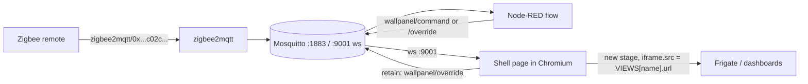

# Architecture

> **Status:** built and running. This describes the system *as-built*, not as
> originally designed. Where a decision has operational scars worth knowing,
> they're called out. See `todo.md` for what's done vs. remaining.

## Goal

A wall-mounted panel showing web views (a Frigate camera, and — planned —
weather / rain / electricity price, Grafana, other self-hosted dashboards),
switched by a time-of-day schedule and a physical Zigbee remote, with no
keyboard or mouse attached. Boots straight to the panel unattended.

## Hardware

- **Driver:** HP EliteDesk 800 G4 DM (65W), i5-8500, 16 GB RAM, ~512 GB NVMe.
  Replaced a Dell Wyse 3040 (kept as spare).
- **Display:** Samsung Space 32" monitor, **wall-mounted rotated 90° left
  (portrait)**, driven over HDMI via a **passive DP→HDMI adapter** off the HP's
  DisplayPort. The adapter is marginal — see *Display gotchas*.
- **Control:** an existing **Zigbee remote** (`0x<remote-ieee>`) via the
  homelab's zigbee2mqtt. No ESP32 was built (the original plan); the Zigbee
  remote replaced it.

## Components

| Component            | Runs on            | Job                                                       |
|----------------------|--------------------|----------------------------------------------------------|
| Ubuntu Server        | HP EliteDesk       | Base OS, no desktop environment. Hostname `ubuntukiosk`. |
| Xorg + Openbox       | HP EliteDesk       | Minimal graphical session hosting the browser.           |
| Chromium (`.deb`)    | HP EliteDesk       | Kiosk mode, loads exactly one page: the shell.           |
| Shell page (split)   | in Chromium        | MQTT client + schedule + override; swaps an `<iframe>`.  |
| Mosquitto            | Raspberry Pi <broker-host> | Message bus. Has a websockets listener on 9001.   |
| Node-RED             | Raspberry Pi       | Translates the Zigbee remote → panel view commands.      |
| zigbee2mqtt          | Raspberry Pi       | Publishes the remote's button actions to MQTT.           |
| Content sources      | homelab            | Frigate (<frigate-host>:5000), future dashboards.         |

The Pi is the always-on automation hub (zigbee2mqtt, node-red, mosquitto, +HA
planned). The kiosk is a *display appliance* and deliberately holds no
automation state — everything routes through the Pi's broker.

## Data flow



Nothing talks to the panel directly — all control is MQTT. Anything (Node-RED,
Home Assistant, a cron job, `mosquitto_pub`) can drive the panel by publishing
the same topics.

## MQTT topics

| Topic                     | Direction         | Retained | Payload                                   |
|---------------------------|-------------------|----------|-------------------------------------------|
| `wallpanel/command`       | controller → shell| no       | `next` / `prev` / `blank` (an **intent**) |
| `wallpanel/view/set`      | controller → shell| no       | a view name, e.g. `tapo`                  |
| `wallpanel/override`      | shell/NR ↔ broker | **yes**  | JSON `{view, periodId}`, or `""` to clear |
| `wallpanel/status`        | shell → broker    | **yes**  | `online` / `offline` (LWT)                |
| `wallpanel/view/current`  | shell → broker    | **yes**  | name of the view actually on screen       |
| `wallpanel/views`         | shell → broker    | **yes**  | JSON array: the arrow rotation, in order  |

**Intents vs. names.** `wallpanel/command` is the important one: it lets a
controller say *what the user wants* (`next`) without knowing *what views exist*.
The shell resolves it against `views.js`. `view/set` (by name) still works and is
the convenient form for scripts and `mosquitto_pub`.

Only `set`, `override` and `status` are named in `config.js`; the shell derives
`command`, `view/current` and `views` from the same base, so the chmod-600
secret file never has to be edited to pick up a new topic.

The **override** topic is the heart of the control model (see *Scheduling*).
Publishing a view name to `wallpanel/view/set` sets a manual override; the shell
records it (with the current period id) and republishes to `wallpanel/override`
retained, so it survives a reboot. Publishing an empty retained message to
`wallpanel/override` clears the override and resumes the schedule.

> Note: `wallpanel/view/current` once meant "the view to restore on boot"; that
> job belongs to `wallpanel/override` now. The topic was reclaimed as pure
> **observability** — the shell publishes it on every render, so you can see what
> the panel is showing without looking at the wall (and a watchdog can diff it
> against `override`). Nothing reads it back.

## Auth

The broker requires authentication (`allow_anonymous false` on the Pi). A
dedicated **`wallpanel`** MQTT user was created (`mosquitto_passwd`). The shell
page connects with it (credentials in `config.js`, which is gitignored along
with the LAN hosts and coordinates). Because the credential is
visible in page source, scope it with a broker ACL to `wallpanel/#` if it ever
matters (not done yet). Node-RED uses its own existing broker credentials.

## The shell (split into files)

Lives at `/opt/wallpanel/shell/`. Originally one `index.html`; **split for
maintainability** into:

| File          | Purpose                                                        | Edit frequency |
|---------------|---------------------------------------------------------------|----------------|
| `index.html`  | Skeleton: the stage stack, overlay, `<script>` tags in order. | rare           |
| `config.js`   | Broker URL, `wallpanel` credentials, topics, LAN hosts, places. **Secret, gitignored** — copy `config.example.js`. | rare (chmod 600)|
| `views.js`    | `window.VIEWS` — view name → `{url, rotate, cycle}`. **The view list.** | **often** |
| `schedule.js` | `window.SCHEDULE` + `window.OFF_VIEW` — the time table.        | often          |
| `app.js`      | The logic: MQTT, `tick()`, the stage renderer, overrides.      | rare           |
| `style.css`   | Stage geometry/crossfade + overlay styling.                    | rare           |
| `photo.html`  | Full-bleed still-image view; shows `media/image.jpg`.          | rare           |
|`overview.html`| The dial: price + weather on one clock. Places from `config.js`.| rare         |
| `media/`      | Images used by views. Not tracked — supply your own.           | occasionally   |
| `mqtt.min.js` | Bundled MQTT.js (~330 KB), local (no CDN).                     | never          |

**Loaded as plain `<script>` globals, NOT ES modules.** ES modules hit CORS
restrictions from `file://` in Chromium and would need a local server or a
flag; globals just work off disk. Load order (set in `index.html`):
`mqtt.min.js → config.js → views.js → schedule.js → app.js`.

### The stage model (why views don't visibly rotate)

A view has two properties that must change **together**: its content (iframe
`src`) and its orientation. The display is already rotated 90° at the driver
level for the portrait mount, so a landscape source — the camera — has to be
counter-rotated −90° to fill the panel as landscape; a dashboard or photo needs
0°.

The trap: orientation is instant, content takes time to load. The original
renderer mutated both on one shared iframe, so switching from a 0° view to a
−90° view **rotated the view you were still looking at**, and only then swapped
in the new one. You saw the old page spin, then blink.

The fix is structural, not cosmetic: **orientation is never mutated.** Each view
is rendered into its own `<div class="stage" data-rotate="…">` built with its
orientation already set; all the geometry lives in `style.css`, keyed off that
attribute. Switching views means:

1. build a new stage (orientation baked in) and append it — it is on top in DOM
   order but at `opacity: 0`, so it loads **invisibly, underneath**;
2. wait for the iframe's `load` (capped at 4 s so a dead page can't strand us,
   plus a short settle so we never fade into an unpainted frame);
3. crossfade it in over the outgoing stage, which is still fully opaque —
   there is no dip to black;
4. remove the old stage once it's hidden, tearing down its camera stream.

Consequences worth keeping: nothing on screen ever rotates; there is no black
gap between views (the outgoing stage holds at full opacity until it is
covered); a burst of arrow presses discards the not-yet-shown stage rather than
queueing swaps; and `rotate` is now **degrees** (`0`, `90`, `-90`, `180`;
`true` still means `-90`), so a new odd-orientation source needs no new code.
Crossfade duration lives in `--fade` (`style.css`) and `FADE_MS` (`app.js`) —
keep them in sync.

## Scheduling + override model

Implemented entirely in the shell (browser clock). `app.js`:

- **`SCHEDULE`** (in `schedule.js`) is an ordered list of periods
  `{id, start, end (minutes from midnight), view}`. Current periods:
  `06:00–08:00 → weather`, `19:00–00:00 → tapo` (camera). Any uncovered time
  falls through to `OFF_VIEW` (`off` = a black page).
- **`tick()`** runs every 30 s (and on connect / on message). It computes the
  current period; if a manual override exists but was set in a *different*
  period, the override has expired and is dropped; then it renders either the
  override view or the period's default.
- **Override lifetime:** a press sets `override = {view, periodId}` for the
  *current* period only. It expires at the next period boundary, then the
  schedule resumes. Retained to `wallpanel/override` so a reboot restores it.

**"Screen off" is a black page, not DPMS/monitor-power-off** — deliberate. This
matches the `black.sh` approach used on the old Wyse and avoids poking the
marginal adapter with sleep/wake cycles (which caused problems — see gotchas).

## Physical control (Zigbee remote via Node-RED)

The remote publishes actions to `zigbee2mqtt/0x<remote-ieee>` as JSON
`{"action": "..."}`. A **Node-RED flow** (`wallpanel-nodered-flow.json`)
translates them — keeping the shell generic (it only knows `wallpanel/*`):

| Action              | Publishes                                    | Retained |
|---------------------|----------------------------------------------|----------|
| `arrow_right_click` | `wallpanel/command` = `next`                 | no       |
| `arrow_left_click`  | `wallpanel/command` = `prev`                 | no       |
| `off`               | `wallpanel/command` = `blank`                | no       |
| `on`                | `wallpanel/override` = `""` (resume schedule)| **yes**  |

**The flow contains no view names at all** — not even `off`, which is sent as the
intent `blank` and mapped to `OFF_VIEW` by the shell. It is a fixed four-entry
lookup table from button to intent, so it never needs re-importing when the view
list changes.

Two consequences worth knowing:

- **`views.js` is the single source of truth.** The arrow rotation is derived
  from it at runtime — every view joins the rotation in declaration order unless
  it sets `cycle: false` (as `off` does). Adding a view is a one-file edit.
- **The cursor is the screen.** `next`/`prev` step relative to the view actually
  being shown, not to a counter held in Node-RED `context`. The old design could
  desync — the schedule or a `view/set` would move the panel without moving
  Node-RED's index, so the next arrow press jumped somewhere unexpected. There is
  no cursor to desync now.

`on` clears the retained override *directly* rather than going through an intent.
That is deliberate: clearing the override is view-agnostic, and doing it at the
broker means resuming the schedule still works while the panel is offline (the
shell isn't there to relay an intent, and the stale override would otherwise be
restored on next boot).

> **Node-RED empty-topic pattern:** the flow's MQTT-out node has a blank topic
> and blank retain *on purpose* — it honors per-message `msg.topic` and
> `msg.retain` set by the function node, so one output node can publish to both
> `wallpanel/view/set` (no retain) and `wallpanel/override` (retain). If some
> Node-RED version defaults retain to "false" instead of blank, the `on`
> button's override-clear may not persist across reconnects — check that first.

## The overview dial

`overview.html` is one view carrying both datasets, because they answer the same
question — *is now a good moment* — and two separate pages made you wait for the
rotation to bring the other one round.

It is a working 12-hour clock face: rim, minute ticks, real hour and minute hands
on a hub. Twelve hours is exactly one turn, which is what makes the metaphor
work — every hour lands where a clock would put it, so the hands point at the
data. Reading outward from the middle:

| Ring | Carries |
|------|---------|
| Face, where a clock keeps its numerals | that hour's **average electricity price** |
| The coloured bezel | the **15-minute spot price**, as colour |
| Outside the bezel | that hour's **weather symbol** and **temperature** |

**Everything belonging to an hour sits on that hour's half-hour spoke**, in the
middle of its wedge rather than on the boundary tick — price inside and weather
outside on one radius. These are averages *over* the hour, not readings *at* the
tick, and putting them on the tick misrepresented that.

There are no hour numerals. The hands and the tick ring say the time, and each
wedge sits at its own clock position, so the hour is never ambiguous — which
frees the numeral positions for the prices, the thing a glance is actually for.

**Precipitation is in the symbol, not a number.** One, two or three drops for
light, moderate and heavy rain; the same in flakes for snow; a sun or a moon for
clear sky, cloud for overcast, and a bolt for thunder. Intensity comes from the
actual amount (mm of rain, cm of snowfall) rather than from the WMO code, so
"how much" is answered by the measurement and the symbol only has to show one,
two or three. This replaced a millimetre figure, which cost a second line of
text per hour and said less at a glance.

Day and night come from the day's real sunrise/sunset, so an overnight hour gets
a moon rather than a sun — **drawn at its actual phase**. Note the phase glyph is
two arcs: a semicircular lit limb and an elliptical terminator, and the sweep
flag on that second arc is easy to get backwards. Getting it wrong renders every
phase as its own complement — a new moon draws as full, a full moon as empty —
while the quarters still look right, because they are symmetric. There is a
phase strip in the scratchpad tests; check new and full, never a quarter.

Keep the dial uncluttered: one symbol and one number per hour is the budget.

**One weather topic, top right**, for the next twelve hours: the most
consequential condition in the window (rain outranks cloud — you want to know it
is going to rain, not that it is cloudy on average), with total rainfall and peak
gusts. Wind is there because it is the one useful thing the ring cannot show.

### Sources

Both send `Access-Control-Allow-Origin: *`, which is the only reason any of this
works from the kiosk's `file://` origin (where the Origin header is literally
`null`), and neither needs a key.

- **spot-hinta.fi** — Finnish day-ahead price at the 15-minute market time unit,
  VAT included in the figure itself, so 25.5 % is not hardcoded. The obvious
  alternatives both failed: `api.porssisahko.net` is hourly *and* sends no CORS
  header; `dashboard.elering.ee` has 15-minute data but no CORS header either.
- **Open-Meteo** — hourly temperature, precipitation, weather code and gusts.
  `wind_speed_unit=ms` (it defaults to km/h; Finland reads m/s) and
  `timezone=Europe/Helsinki` so the series lines up with the panel's clock.

Tomorrow's prices only exist after the auction clears (~14:00 local), and the
dial needs them as soon as the next twelve hours cross midnight. That fetch is
allowed to fail on its own; hours with no price yet are drawn as an empty outline
with `–`, while still showing their temperature. Both payloads are cached in
`localStorage` and repainted instantly on load, so a wifi blip shows slightly
stale numbers with an amber marker rather than a blank wall.

### Configuration

Places come from `config.js` (`CONFIG.places`, first entry is the default), so no
coordinates sit in a file that is safe to publish. Margin is the retailer margin
in **snt/kWh, VAT-inclusive**, added to every price shown:

```
overview.html                            # CONFIG.places first entry, margin 0.5
overview.html?place=<key>
overview.html?lat=..&lon=..&name=..      # ad hoc, no config needed
overview.html?margin=0.6                 # or CONFIG.electricity.marginSnt
```

The margin unit is spelled out because the same number read as EUR/kWh is a
hundred times larger and the display would still look plausible: at 0.5 snt/kWh
the margin is ~24 % of a typical day's average and the day's shape stays
readable; 0.5 EUR/kWh would flatten every wedge into one colour. Pass
`&marginUnit=eur` or `&marginUnit=eurmwh` if a contract quotes it otherwise. The
margin is **not printed on screen**, so this file and `config.js` are the only
record of what the dial includes. It knows nothing about transfer fees or a
monthly basic charge.

**`overview.html` is loaded in an iframe, so it loads its own
`<script src="config.js">`** — it does not inherit `window.CONFIG` from
`index.html`. Forgetting this is silent: the dial still draws, just with no
location and no temperatures.

### Colour

Colour is the encoding, on fixed thresholds rather than the day's own spread:
green below 10 snt/kWh, yellow-to-orange 10–20, red above 20, negative prices
at the deepest green. Because absolute thresholds cannot be read off the ring
alone, the key at the bottom is not decoration — do not remove it.

It is **one continuous pastel ramp**, not three flat bands: mint lightening
through pale sage to butter, then apricot and peach into coral and rose.
Neighbouring hours differ by a shade, so the ring reads as a gradient rather than
a bar chart bent into a circle. The thresholds are still legible as turns in the
ramp; nothing steps.

**Pastels suit this near-black surface far better than the saturated version they
replaced.** Every stop now sits between 6.7:1 and 14.2:1 against the surface,
where the saturated ramp bottomed out at 3.02:1 and its burgundy end was
confusable with the empty "no price yet" track. On a dark panel the dark end of a
ramp is the dangerous end, and pastels simply do not have one.

The pair to watch when retuning is **butter against the expensive end**. A salmon
was tried there first and measured **dE 13.5** against butter in normal vision —
below the 15 floor, so "middling" and "expensive" looked alike at a glance.
Pushing the top of the ramp toward rose rather than orange fixed it: adjacent band
anchors now separate by dE 19.8 and the extremes by 25.3, while no single step
exceeds dE 6.0, which is what keeps it continuous.

Colour-blind separation is deliberately **not** a constraint on this panel.

### Drawing the ring

The ring is **360 one-degree segments**, each coloured from the price
interpolated at that instant rather than from the quarter-hour it falls in. Two
things follow, both deliberate:

- **No gaps between hours.** An earlier version left 1.8° of background
  between hour wedges to mark the boundaries. It made the ring look segmented,
  and was the single biggest reason the dial read as a tachometer.
- **Colour changes continuously.** Each quarter-hour price is treated as sampled
  at the *centre* of its quarter and interpolated between centres, which is what
  keeps the gradient smooth across a boundary instead of stepping at it.

Segments overlap by 0.45° so antialiasing cannot leave hairlines between them.

There is one genuine hard edge, where the twelve-hour window wraps — the start
of the current hour, where the oldest and newest hour meet. That discontinuity is
real data rather than an artefact: everything clockwise of it is the future.

An empty track ring is drawn underneath everything, so hours with no price yet
show as bare track rather than as a hole.

### Placement rules the layout depends on

- Hour prices sit at `R_PRICE`, well clear of the tick ring; at a larger radius
  they collide with the hour ticks.
- The hands are **tapered blades with a counterweight tail**, drawn as filled
  polygons — broad at the shoulder, coming to a point. A constant-width rounded
  line is a speedometer needle; this is what reads as a clock. Hour markers are
  **batons** rather than hairlines for the same reason, with a fine minute track
  between them.
- The hands are drawn **twice** — a surface-coloured halo, then the hand. Without
  it a white hand crossing a white price is unreadable, and unlike a clock's
  numerals these figures are the data.
- The centre belongs to the hands, so the current price is a hero in the header.
  An earlier revision put it in the middle and every attempt to mark "now" fought
  with it; once the price moved out, real hands became possible and the marker
  problem disappeared — the hands *are* the marker.

> **Superseded:** `weather.html` and `electricity.html` were the two views this
> replaced. They are still in the tree and in git history but are no longer in
> `views.js`. `weather.html` has detail the dial deliberately drops (an hourly
> temperature chart, a rain chart, sunrise/sunset) if you ever want it back.

## Reading these views from across the room

**The panel is only 68.8 ppi.** 32" diagonal at 1080×1920 works out to
0.369 mm per pixel — roughly a third the density of a phone. That single number
governs how these views are typed, and it is the thing that is easy to forget
when editing them on a laptop:

| SVG font size | Cap height on the wall | Comfortable to about |
|---------------|------------------------|----------------------|
| 22 px         | 5.7 mm                 | 1.1 m                |
| 30 px         | 7.8 mm                 | 1.5 m                |
| **40 px**     | **10.4 mm**            | **2.1 m**            |

(Rule of thumb: legible cap height ≈ viewing distance ÷ 200.) Axis ticks and
chart labels are therefore **40 px in viewBox units**, which looks absurdly large
in a browser at arm's length and is correct on the wall. Chart gutters
(`PAD_R`) are sized to fit those labels — shrink the type and the gutters are
merely roomy; grow it without widening them and the right-hand values clip.

Both data views share a measured ink scale:

| Token     | Value     | Contrast vs `#0d1014` | Used for                 |
|-----------|-----------|-----------------------|--------------------------|
| `--ink`   | `#e6edf3` | 16.1:1                | hero numbers, headlines  |
| `--ink-2` | `#c9d3dd` | 12.6:1                | unit suffixes, legends   |
| `--ink-3` | `#bcc7d3` | 11.1:1                | axis ticks, small labels |

These are deliberately bright. The first cut used `#5d6773` at **3.32:1** (below
the 4.5:1 small-text floor) and a second pass at `#8794a3`/6.2:1 was *still*
reported unreadable from the sofa. **Hierarchy on this panel comes from size and
weight, not from dimming text toward the background** — at 68.8 ppi and a few
metres, a dim grey is not "secondary", it is invisible. Measure against the
surface; do not judge on a bright monitor at arm's length.

Two related rules these views follow: **text wears text ink, never the series
colour** (numerals in the series colour on top of same-coloured columns are
unreadable), and direct labels go **above** a mark, never inside a dense field of
neighbours. Where a value's qualifier no longer fits beside it ("0.94" +
"at 16:30"), the qualifier stacks underneath rather than shrinking.

## Display gotchas (hard-won)

The whole display path fought back; these are the settled facts:

- **Output is `DP-1`** (confirm via `/sys/class/drm/*/status`). The passive
  adapter enumerates as a DP connector, not HDMI.
- **Passive adapter, HDMI 1.4 ceiling — confirmed.** `xrandr` shows 4K capped
  at 30 Hz (the HDMI-1.4 signature); 4K@60 needs HDMI 2.0 which a passive DP++
  adapter cannot do. Running **1080p@60**, which is within spec and stable.
- **Resolution is pinned in two layers:** kernel `video=DP-1:1920x1080@60` on
  the GRUB line (also fixes the text console), and `xrandr --mode ...` in
  `start-kiosk.sh` (belt-and-suspenders).
- **Rotation is at the driver level**, not xrandr:
  `/etc/X11/xorg.conf.d/90-rotate.conf` → `Option "Rotate" "right"`. This
  brings the panel up rotated from frame 1 and fixed a wrong-orientation flash.
  (The `start-kiosk.sh` xrandr line no longer carries `--rotate`.)
- **NEVER set the mode live with `xrandr --mode`** after boot — it corrupts the
  marginal link (ghosting ~300 px offset, colour errors). Bring the display up
  only via `sudo systemctl restart getty@tty1` or a reboot, which re-trains
  cleanly.
- **GRUB cmdline (full):**
  `video=DP-1:1920x1080@60 consoleblank=0 fbcon=rotate:1`
  (`consoleblank=0` = no bare-console blanking; `fbcon=rotate:1` = rotate the
  text console to match portrait).
- **The monitor blacked out after a while** ("shuts off" but SSH stays up,
  HP still outputs a valid signal). Not DPMS (X DPMS is disabled; keypress
  didn't wake it; a signal off/on cycle did). Believed addressed by a
  combination of: WiFi power-save fix, forcing the monitor's **HDMI input to
  1.4** in its OSD (more forgiving signalling for the marginal adapter), and a
  clean session. **Watch for recurrence.** If it returns, run
  `DISPLAY=:0 xrandr | grep connected` *while black*: `connected` = monitor
  sleeping on a good signal (OSD/eco setting); `disconnected` = adapter
  dropping the link (→ active adapter or a DP→Mini-DP cable, the real fix).
- **CEC device exists** (`rc rc0: DP-1`). Dormant (no remote on that path). If
  phantom keypresses ever appear, disable CEC / blacklist the input node.
- **Best long-term display fix:** the Space has a **Mini DisplayPort input** —
  a **DP→Mini-DP cable** drops the adapter entirely (clean DP 1.2 end-to-end,
  no HDMI ceiling, no marginality). Cheaper than an active adapter. Not done.

## Boot / session chain

Boots to the panel with **no login prompt**, running as user **`user`**:

```
getty@tty1 (autologin) → ~/.profile (guarded exec startx, tty1 only)
  → ~/.xinitrc (openbox & ; exec start-kiosk.sh)
  → start-kiosk.sh (xrandr mode; xset no-blank; Chromium in a relaunch loop)
```

- **Autologin:** getty override at
  `/etc/systemd/system/getty@tty1.service.d/override.conf` →
  `agetty --autologin user`.
- **`~/.profile`** starts X only on tty1 (SSH sessions get a normal shell —
  this is the recovery path if the kiosk misbehaves).
- **Chromium relaunch loop** in `start-kiosk.sh` restarts the browser if it
  dies; getty respawns the whole session if X dies. Recovery at both levels.
- **Chromium flags of note:** `--kiosk --incognito`, force-dark
  (`--force-dark-mode --enable-features=WebContentsForceDark`), and
  `--app=file:///opt/wallpanel/shell/index.html`.
- Script uses `set -uo pipefail` (no `-e`) so transient failures don't kill it.

## System files (on the kiosk, outside the repo shell dir)

These live in system locations, not `/opt/wallpanel/shell/`. A handoff should
know they exist:

- `/etc/default/grub` — the `GRUB_CMDLINE_LINUX_DEFAULT` line (display pin +
  console rotation + no-blank). Run `update-grub` after edits.
- `/etc/X11/xorg.conf.d/90-rotate.conf` — driver rotation.
- `/etc/systemd/system/getty@tty1.service.d/override.conf` — autologin.
- `/etc/systemd/system/wifi-powersave-off.service` — disables WiFi power-save.
- `/etc/modprobe.d/iwlwifi.conf`, `/etc/modprobe.d/iwlmvm.conf` — durable WiFi
  power-save-off (Intel 9560 was dropping/roaming; see gotchas).
- `~/.profile`, `~/.xinitrc` — session start.
- `/opt/wallpanel/system/start-kiosk.sh` — the kiosk launcher.
- Timezone: `Europe/Helsinki` (`timedatectl`); NTP active (DST auto).
- Netplan: `eno1` marked `optional: true` (unplugged ethernet was hanging boot
  ~1m37s on `systemd-networkd-wait-online`).

## Alternative considered: remote-debugging + CDP

If a target page refuses to be iframed (`X-Frame-Options`/CSP), the fallback is
launching Chromium with `--remote-debugging-port=9222` and a small service that
drives `Page.navigate` over the DevTools protocol — a genuine top-level load
per view instead of an iframe. Not needed so far (Frigate frames fine). Parked.
